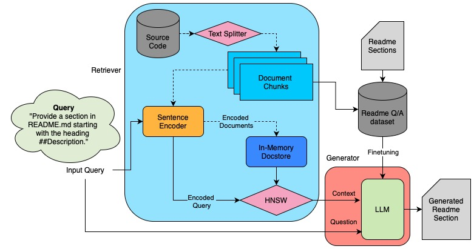

# Summary

Automated documentation of programming source code is a challenging task with significant practical and scientific implications for the developer community. ReadmeReady is a large language model (LLM)-based application that developers can use as a support tool to generate basic documentation for any publicly available or custom repository. Over the last decade, several research have been done on generating documentation for source code using neural network architectures. With the recent advancements in LLM technology, some open-source applications have been developed to address this problem. However, these applications typically rely on the OpenAI APIs, which incur substantial financial costs, particularly for large repositories. Moreover, none of these open-source applications offer a fine-tuned model or features to enable users to fine-tune custom LLMs. Additionally, finding suitable data for fine-tuning is often challenging. Our application addresses these issues.

# Statement of Need

The integration of natural and programming languages is a research area that addresses tasks such as automatic documentation of source code, code generation from natural language descriptions, and searching for code using natural language queries. These tasks are highly practical, as they can significantly enhance programmer efficiency, and they are scientifically intriguing due to their complexity and the proposed relationships between natural language, computation, and reasoning([@chomsky1956three], [@miller2003cognitive], [@graves2014neural]).

# State of the Field

Recently, large language models (LLMs) have become increasingly significant, demonstrating human-like abilities across various fields [@radford2019language], [@brown2020language], [@ouyang2022training]. LLMs typically employ transformer architecture variants and are trained on massive data volumes to detect patterns [@vaswani2017attention].

We present an LLM-based application that developers can use as a support tool to generate basic documentation for any code repository. Some open-source applications have been developed to address this issue, to name a few:

- **AutoDoc-ChatGPT** [@autodoc-chatgpt]
- **AutoDoc** [@context-labs-autodoc]
- **Auto-GitHub-Docs-Generator** [@microsoft-auto-github-docs-generator]

However, these applications suffer from two major issues. Firstly, all of them are built on top of the OpenAI APIs, requiring users to have an OpenAI API key and incurring a cost with each API request. Generating documentation for a large repository could result in costs reaching hundreds of dollars. Our application allows users to choose among OpenAI's GPT, Meta's Llama2, and Google's Gemma models. Notably, apart from the first, the other models are open-source and incur no charges, allowing documentation to be generated for free.

Secondly, none of the existing open-source applications provide a fine-tuned model or an option for users to fine-tune. Our application offers a fine-tuning option using QLoRA[@dettmers2023qlora], which can be trained on the user's own dataset. It is important to note that using this feature requires access to powerful GPU clusters. Some existing applications provide a command-line tool for interacting with the entire repository, allowing users to ask specific questions about the repository but not generating a README file.

# Methodology

The application prompts the user to enter the project's name, GitHub URL, and select the desired model from the following options:

- `gpt-3.5-turbo` [@gpt-3.5-turbo]
- `gpt-4` [@gpt-4]
- `gpt-4-32k` [@gpt-4-32k]
- `TheBloke/Llama-2-7B-Chat-GPTQ` (quantized) [@llama-2-7b-chat-gptq]
- `TheBloke/CodeLlama-7B-Instruct-GPTQ` (quantized) [@code-llama-7b-instruct-gptq]
- `meta-llama/Llama-2-7b-chat-hf` [@llama-2-7b-chat-hf]
- `meta-llama/CodeLlama-7b-Instruct-hf` [@code-llama-7b-instruct-hf]
- `google/gemma-2b-it` [@gemma-2b-it]
- `google/codegemma-2b-it` [@codegemma-2b-it]

For our experimentation and tests, we used 1 × NVIDIA Tesla V100 with 16GB of GPU memory which is ideal for running the application.

**Document Retrieval:** Our application indexes the codebase through a depth-first traversal of all repository contents and utilizes an LLM to generate documentation. All files are converted into text, tokenized, and then chunked, with each chunk containing 1000 tokens. The application employs the `sentence-transformers/all-mpnet-base-v2` [@sentence-transformers-all-mpnet-base-v2] sentence encoder to convert each chunk into a 768-dimensional embedding vector, which is stored in an in-memory vector store. When a query is provided, it is converted into a similar vector using the same sentence encoder. The neighbor nearest to the query embedding vector is searched using KNN (k=4) from the vector store, utilizing cosine similarity as the distance metric. For the KNN search, we use the HNSWLib library, which implements an approximate nearest-neighbor search based on hierarchical navigable small-world graphs [@malkov2018efficient]. This methodology provides the relevant sections of the source code, aiding in answering the prompted question. The entire methodology for Retrieval Augmented Generation (RAG) and fine-tuning is illustrated in the figure below.

**Prompt Configuration:** Prompt engineering is accomplished using the Langchain API. For our purpose, a prompt template has been used. This template includes placeholders for questions, which users can edit and modify as needed. This flexibility allows the README to be generated according to the user's specific requirements. Our default README structure includes sections on description, requirements, installation, usage, contributing methods, and licensing, which align with standard documentation practices. The temperature for text generation is kept at the default value of 0.2. The current prompts are developer-focused and assume that the repository is code-centric.

## Fine Tuning

In our work, we fine-tune only one model, `TheBloke/Llama-2-7B-Chat-GPTQ` [@llama-2-7b-chat-gptq], which is a 4-bit quantized model with 1.13 billion parameters. It supports a maximum sequence length of 4096 tokens and requires 3.9 GB of memory.

## Data Collection

We limit our scope to Python-based repositories; however, this approach is easily adaptable to multiple programming languages. A CSV file was created with three features: questions, context, and answers. Questions were derived from README file headings and subheadings, identified by markdown signatures `#` or `##`. Answers correspond to the text under these headings.

The entire source code from the repositories is concatenated into a single string and separated into document chunks of 1000 tokens employing LangChain's text-splitter. Using the `sentence-transformers/all-mpnet-base-v2` [@sentence-transformers-all-mpnet-base-v2] sentence encoder, these chunks were converted into 768-dimensional vectors. Each question is then converted into a 768-dimensional vector and subjected to a KNN $(k=4)$ search using HNSW [@malkov2018efficient] to find the closest match from the entire set of document embeddings, stored as the context.

**Data Preprocessing:** Following the creation of the CSV file, we pre-process the data using regex patterns to clean the text. Since the context only captures source code, this eliminates the possibility of using offensive content. Regex is used to remove hashtags, email addresses, usernames, image URLs, and other personally identifiable information. Note that only repositories written entirely in English are used, with other languages filtered out. Prompt engineering in our source code ensures that the prompts are designed to avoid generating any personally identifiable data or offensive content.

# Experiments and Results

We conducted the fine-tuning experiment on a small dataset consisting of randomly selected 190 README files, which may not address our default documentation questions. For each README, we examine its sections and subsections, frame relevant questions, and use the answers generated by our tool for training. For evaluation, we selected the rest of the 10 repositories and compared the original answers with the autogenerated documentation using BLEU and BERT scores to assess our model's performance.

## Before Fine-tuning

We conducted a series of experiments utilizing the `TheBloke/Llama-2-7B-Chat-GPTQ` model [@llama-2-7b-chat-gptq] to demonstrate the functionality and efficacy of our proposed pipeline. The accompanying codebase is designed to be flexible, allowing the user to easily switch between different large language models (LLMs) by simply modifying the configuration file. Given the characteristics of LLMs, models with a greater number of parameters are generally expected to deliver enhanced performance. The BLEU and BERT scores for the `TheBloke/Llama-2-7B-Chat-GPTQ` model are reported in Table 1 and Table 2, under the "W/O FT" or "W/O Finetuning" columns.

## After Fine-tuning

We utilized the PEFT library from Hugging Face, which supports several Parameter Efficient Fine-Tuning (PEFT) methods. This approach is cost-effective for fine-tuning large language models (LLMs), particularly on lightweight hardware. The training configuration and hyperparameters are detailed in Table 3 and Table 4 respectively. The results are reported in Table 1 and Table 2, under the "With FT" or "With Finetuning" columns where the contents are compared with each repository's original README file. It is observed that BLEU scores range from 15 to 30, averaging 20, indicating that the generated text is understandable but requires substantial editing to be acceptable. Conversely, BERT scores reveal a high semantic similarity to the original README content, with an average F1 score of ~85%.

### Table 1: BLEU Scores

| Repository | W/O FT | With FT |
|------------|--------|---------|
| allennlp   | 32.09  | 16.38   |
| autojump   | 25.29  | 18.73   |
| numpy-ml   | 16.61  | 19.02   |
| Spleeter   | 18.33  | 19.47   |
| TouchPose  | 17.04  | 8.05    |

### Table 2: BERT Scores

| Repository | P (W/O FT) | R (W/O FT) | F1 (W/O FT) | P (With FT) | R (With FT) | F1 (With FT) |
|------------|------------|------------|-------------|-------------|-------------|--------------|
| allennlp   | 0.904      | 0.8861     | 0.895       | 0.862       | 0.869       | 0.865        |
| autojump   | 0.907      | 0.86       | 0.883       | 0.846       | 0.87        | 0.858        |
| numpy-ml   | 0.89       | 0.881      | 0.885       | 0.854       | 0.846       | 0.85         |
| Spleeter   | 0.86       | 0.845      | 0.852       | 0.865       | 0.866       | 0.865        |
| TouchPose  | 0.87       | 0.841      | 0.856       | 0.831       | 0.809       | 0.82         |

### Table 3: QLoRA Configuration

| Parameter     | Value |
|---------------|-------|
| `r`           | 2     |
| `lora_alpha`  | 32    |
| `lora_dropout`| 0.05  |
| `bias`        | None  |
| `task_type`   | CAUSAL_LM |

### Table 4: Training Hyper-parameters

| Parameter                         | Value    |
|-----------------------------------|----------|
| `per_device_train_batch_size`     | 1        |
| `gradient_accumulation_steps`     | 1        |
| `num_train_epochs`                | 3        |
| `learning_rate`                   | 1e-4     |
| `fp16`                            | True     |
| `optim`                           | paged_adamw_8bit |
| `lr_scheduler_type`               | cosine   |
| `warmup_ratio`                    | 0.01     |

# References